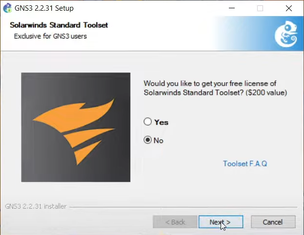

# Instalación y ejecución del programa

## Progrmas usados:
* GNS3
* Oracle VirtualBox

> [!IMPORTANT]
> El programa fue desarrollado con el lenguage de C, tanto el servidor como el cliente.

### Instalación GNS3

Primero, debemos dirigirnos a la página de descarga del programa [GNS3](https://www.gns3.com). Hacemos clic en el botón que dice 'Free Download' y descargamos la versión correspondiente a nuestro sistema operativo.


Para la instalación, dejamos todo por defecto, y cuando el programa pregunte si queremos comprar una licencia, elegimos la opción 'No'.



Además, debemos descargar una imagen para poder hacer algunas configuraciones del programa más adelante. Es para la configuración de un router Cisco 3660 (c3660).

> [!NOTE]
> El archivo se puede encontrar en la carpta Documentos-Utiles.

Para no tener problemas, el archivo debe guardarse en la siguiente dirección:
```
C:
└── Usuarios
  └── <su_usuario>
    └── GNS3
      └── imagenes
        └── IOS
```

Aquí finaliza la instalación de GNS3.

### Instalacón de Oracle VirtualBox