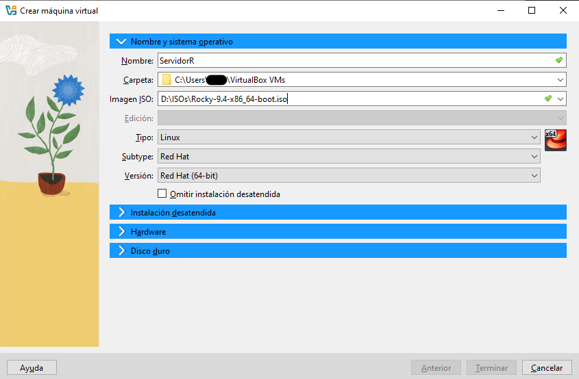
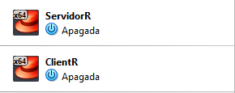

# Instalación y ejecución del programa

<!-- > [!WARNING] -->
> Procure seguir las instrucciones paso a paso.

## Programas usados:
* GNS3
* Oracle VirtualBox

> [!IMPORTANT]
> El programa fue desarrollado en C, tanto el servidor como el cliente.

### Instalación GNS3

Primero, debemos dirigirnos a [la página de descarga de GNS3](https://www.gns3.com). Hacemos clic en el botón que dice 'Free Download' y descargamos la versión correspondiente a nuestro sistema operativo.

<p align="center">
  
</p>


Para la instalación, dejamos todo por defecto, y cuando el programa pregunte si queremos comprar una licencia, elegimos la opción 'No'.

<p align="center">
  
</p>

Además, debemos descargar una imagen para poder hacer algunas configuraciones del programa más adelante. Es para la configuración de un router Cisco 3660 (c3660).

> [!NOTE]
> El archivo se puede encontrar en la carpeta Documentos-Utiles.

Para no tener problemas, el archivo debe guardarse en la siguiente dirección:
```
C:
└── Usuarios
    └── <su_usuario>
        └── GNS3
            └── imagenes
                └── IOS
```

Aquí finaliza la instalación de GNS3.

### Instalacón de Oracle VirtualBox

Nos dirigimos a [la página de descarga de Oracle VirtualBox](https://www.virtualbox.org). Hacemos clic en el botón que dice 'Download' y seleccionamos el sistema operativo correspondiente a nuestra instalación.

<p align="center">
  
</p>

Dejamos toda la instalación por defecto y tendríamos VirtualBox instalado.

## Instalación de la máquinas virtuales

Debemos descargar una imagen, que sería el archivo ISO de nuestro sistema operativo. En este caso, usaremos Ubuntu. Nos dirigimos [la página página principal de Ubuntu](https://ubuntu.com/download/desktop) y seleccionamos el botón que dice 'Download 24.04.1 LTS.'

<p align="center">
  
</p>

Para crear las máquinas virtuales, debemos ingresar a VirtualBox y hacer clic en el botón 'Nueva'.

En la pestaña 'Nombre y Sistema Operativo', debemos configurarlo de la siguiente forma: el nombre que queremos asignar a la máquina, la carpeta donde la queremos almacenar y seleccionar la imagen del sistema operativo. Lo demás lo dejamos por defecto.

<p align="center">
  
</p>

> [!IMPORTANT]
> - En la pestaña 'Instalación desatendida' se recomienda configurar solo el usuario y contraseña de la maquina.
> - En 'Hardware' se recomienda usar 4 CPUs.
> - En 'Disco duro' se puede dejar por defecto.

Cuando hagamos clic en 'Terminar', se abrirá la máquina y comenzará la instalación del sistema operativo. Cuando finalice, reinicia la máquina.

> [!NOTE]
> Debe hacer este proceso dos veces, ya que necesitamos una máquina para el 'Cliente' y otra para el 'Servidor'.

<p align="center">
  
</p>
